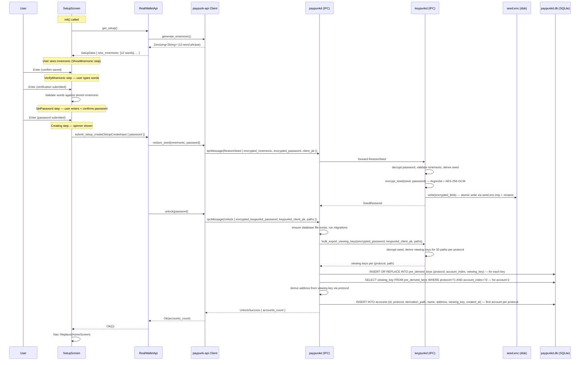
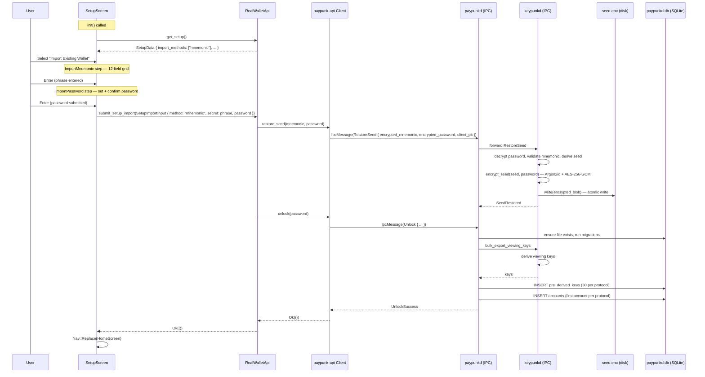

# SetupScreen — Wallet Creation / Import

**File:** `tui/src/screens/setup.rs:32`

Two paths: **Create New Wallet** and **Import Existing Wallet**. Both end with `Nav::Replace(HomeScreen)` on success.

## Create New Wallet Flow

## Import Existing Wallet Flow

