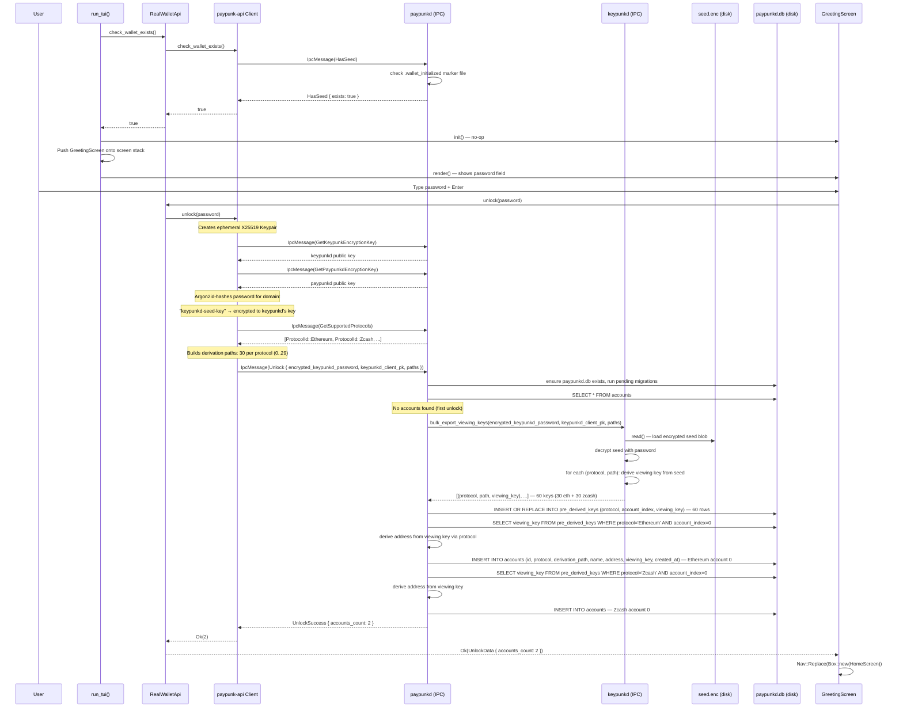

# GreetingScreen — Initial Unlock

**File:** `tui/src/screens/greeting.rs:16`

Shown when `check_wallet_exists()` returns `true` (existing wallet found). Prompts for password, then navigates to HomeScreen.

## Persistence involved:
- **keypunkd** reads `seed.enc` from disk and decrypts with password to derive viewing keys
- **paypunkd** opens `paypunkd.db` (plaintext SQLite), runs migrations
- **paypunkd** writes pre-derived viewing keys to `pre_derived_keys` table
- **paypunkd** writes first account to `accounts` table

