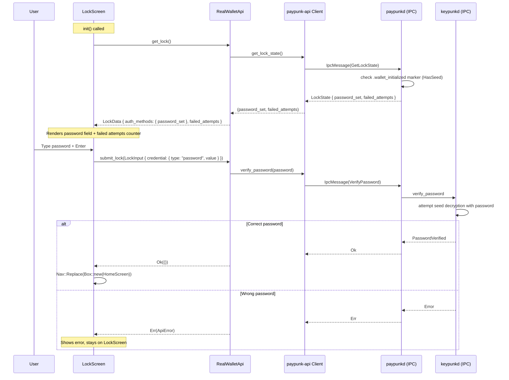

# LockScreen — Re-authentication

**File:** `tui/src/screens/lock.rs:17`

Shown after auto-lock timeout. User authenticates with password to return to HomeScreen.

**Persistence:** `get_lock()` reads lock state (password set, failed attempts) from paypunkd via IPC. `submit_lock()` verifies the password against keypunkd via IPC. Failed attempts are tracked server-side.

On `Esc`, it returns `Nav::Pop`.
