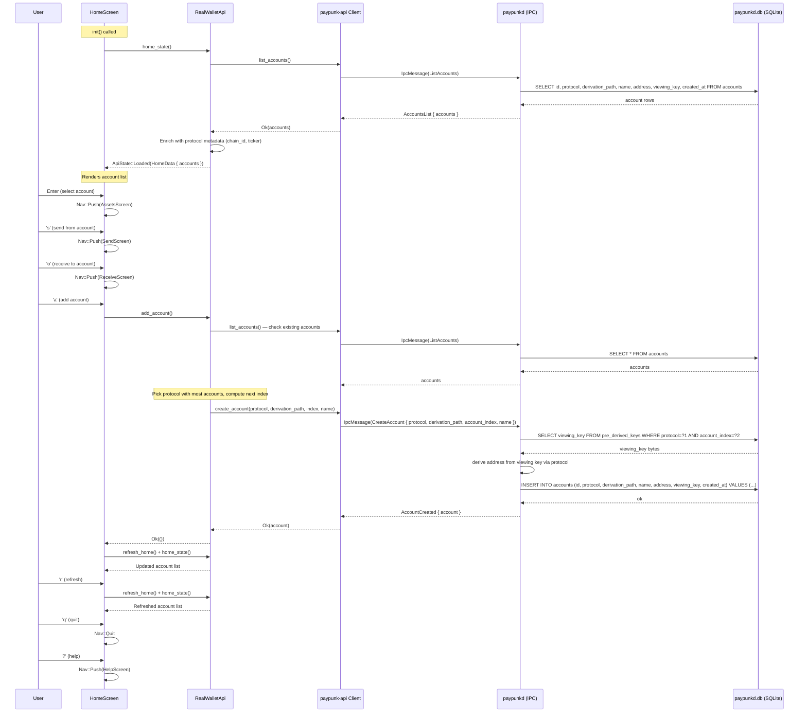
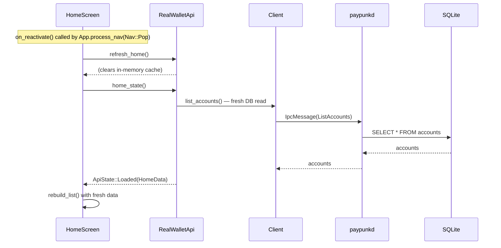

# HomeScreen — Account List / Main Menu

**File:** `tui/src/screens/home.rs:19`

Displays all wallet accounts in a selectable list. Entry point for all other screens.

**Persistence involved:**
- `list_accounts()` reads from `accounts` SQLite table via `paypunkd`
- `add_account()` reads `pre_derived_keys` table for the viewing key, then inserts into `accounts` table

## Reactivation Flow (returning from child screen)

