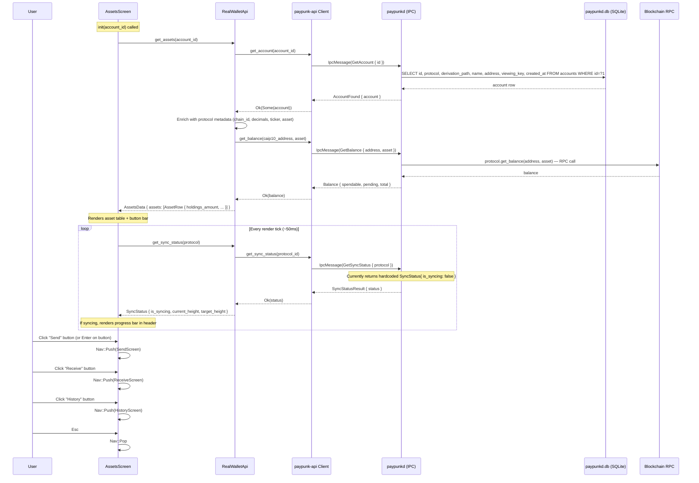
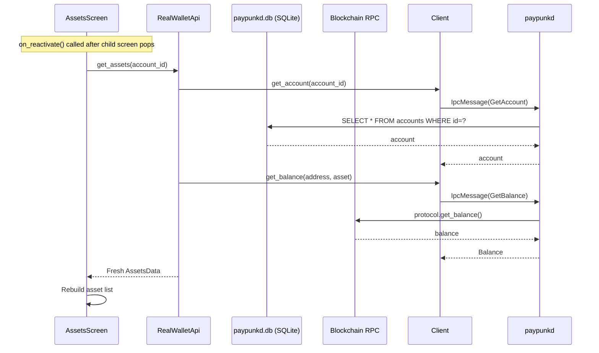

# AssetsScreen — Balance View

**File:** `tui/src/screens/assets.rs:27`

Shows account's asset holdings. Has Send/Receive/History buttons and sync status polling.

**Persistence involved:**
- `get_assets()` reads from `accounts` SQLite table to get the account's address and protocol
- Balance is fetched from the chain (RPC call via protocol implementation), NOT from the DB
- Sync status is from the protocol layer (no DB)

## Reactivation Flow

