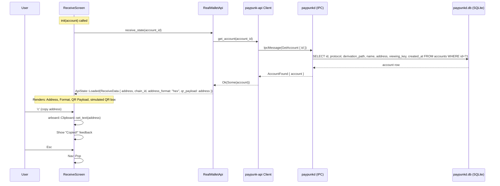
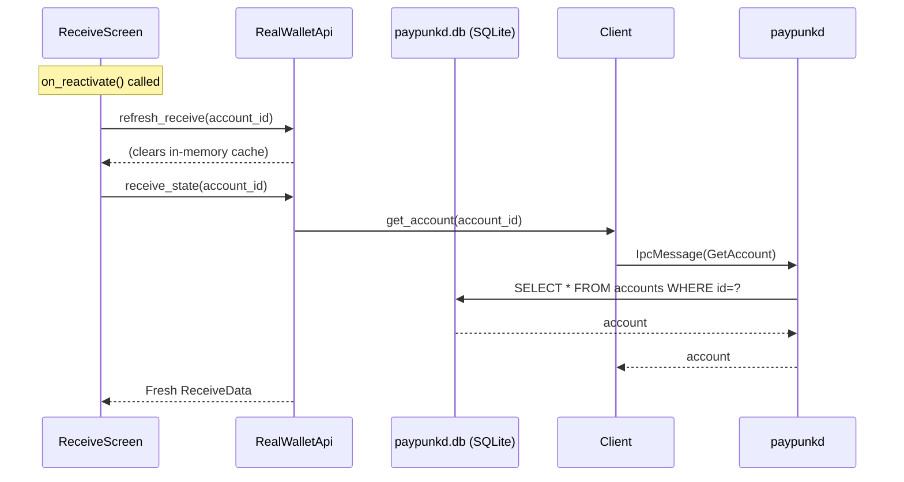

# ReceiveScreen — Display Receiving Address

**File:** `tui/src/screens/receive.rs:15`

Shows the account's receiving address, format info, QR payload, and a simulated QR code.

**Persistence involved:**
- `receive_state()` reads from `accounts` SQLite table to get the account's address
- No writes to any persistence layer

## Reactivation Flow

