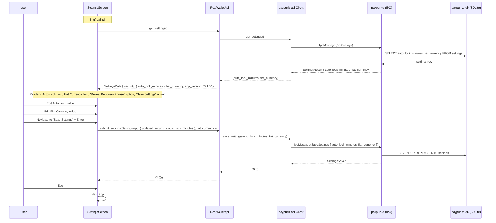
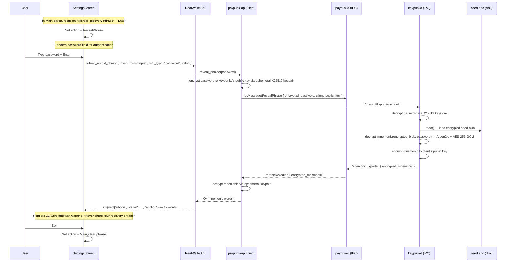

# SettingsScreen — Settings Management

**File:** `tui/src/screens/settings.rs:21`

Two sub-actions: **Main** (edit preferences) and **RevealPhrase** (authenticate to show mnemonic).

**Persistence:** Settings are persisted in the paypunkd SQLite database via `GetSettings`/`SaveSettings` IPC messages. Reveal phrase is implemented end-to-end via keypunkd's `ExportMnemonic`.

## Main Settings Flow

## Reveal Recovery Phrase Flow

