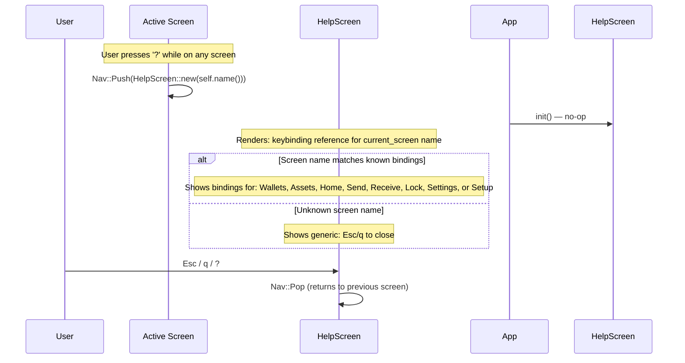

# HelpScreen — Keybinding Overlay

**File:** `tui/src/screens/help.rs:11`

Context-sensitive help overlay pushed on top of the current screen. Dismissed with `Esc`, `q`, or `?`.

**Persistence:** None. Pure UI overlay — no API calls, no IPC, no DB or file access.

The HelpScreen is a **pure UI overlay** — it makes no API calls, has no IPC interactions, and touches no persistence layer. It reads the current screen name from its constructor and returns static keybinding data based on that name.
