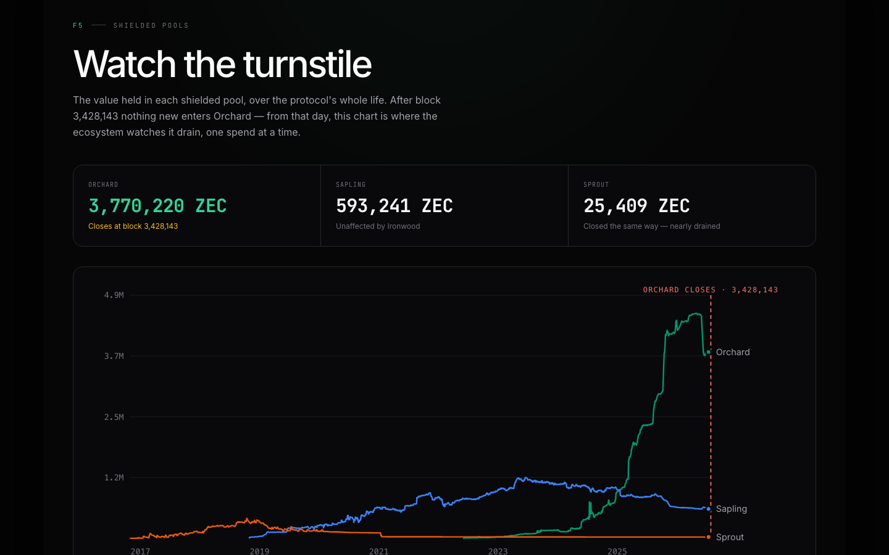
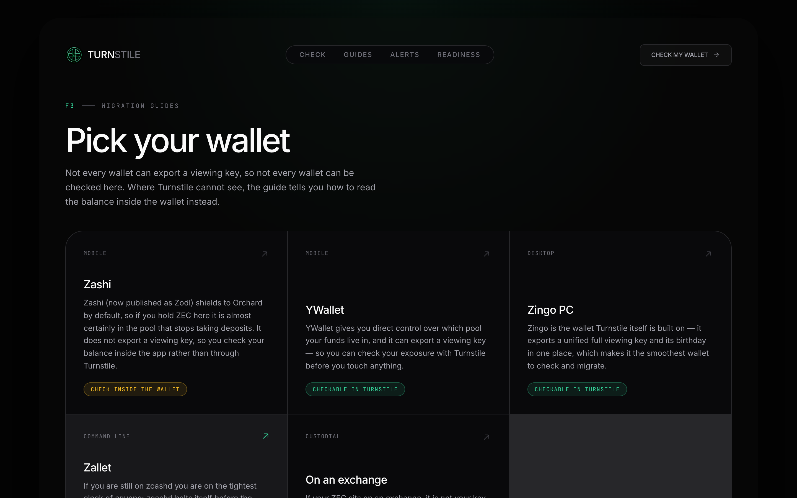
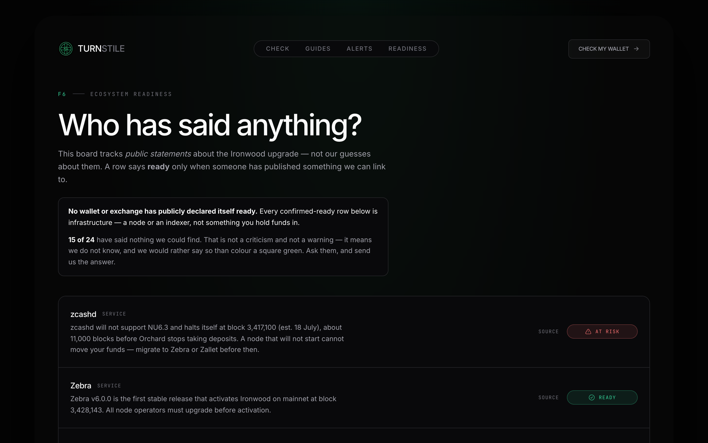
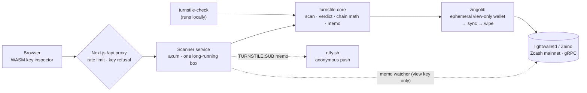

<div align="center">


&nbsp;

[](https://turnstile-xi.vercel.app)
[](LICENSE)


### Is your ZEC ready for Ironwood? Find out in under a minute — without ever touching a spending key.

On ~28 July 2026, at block **3,428,143**, the Ironwood network upgrade closes the Orchard shielded pool to new deposits. Every shielded wallet is affected, and the question every ZEC holder is about to ask has no tool to answer it — _am I exposed, and what do I do?_ Explorers show chain data. Wallets show balances. **Nothing connects _your_ specific funds to _this_ specific deadline, with a plan.** Turnstile does, reading your wallet with a **unified full viewing key** — a key that can *see* but can never *spend* — telling you pool-by-pool where your funds actually sit, and walking you through the fix for your exact wallet.

### ▶ Live now — paste your own viewing key and get a real verdict at **[turnstile-xi.vercel.app](https://turnstile-xi.vercel.app)**

**[ Live demo ↗ ](https://turnstile-xi.vercel.app)** · **[ See a real scan ↗ ](#-see-it-in-one-command)** · **[ The one rule ↗ ](#the-one-rule--never-a-spending-key)** · **[ Architecture ↗ ](#architecture)** · **[ What's real vs pending ↗ ](#whats-real-vs-pending--the-honesty-table)** · **[ Run it locally ↗ ](#run-it-locally)**

Built for **ZecHub Hackathon 3.0** · Infrastructure track · MIT licensed. _An educational tool, not financial advice._

</div>

---

## Table of contents

- [See it in one command](#-see-it-in-one-command)
- [The one rule — never a spending key](#the-one-rule--never-a-spending-key)
- [What Turnstile does](#what-turnstile-does)
  - [Wallet readiness check + the WASM key inspector](#1--wallet-readiness-check--the-hero-feature)
  - [Activation countdown + embeddable widget](#2--activation-countdown)
  - [Shielded pools chart](#3--shielded-pools-chart)
  - [Migration guides](#4--migration-guides)
  - [Anonymous alerts](#5--anonymous-alerts-without-an-account)
  - [Ecosystem readiness board](#6--ecosystem-readiness-board)
- [Architecture](#architecture)
  - [Process model & the security boundary](#process-model--the-security-boundary)
  - [Component by component](#component-by-component)
- [Safety, enforced in code](#safety-enforced-in-code)
- [How it uses Zcash mainnet](#how-it-uses-zcash-mainnet)
- [Engineering decisions & the hard problems](#engineering-decisions--the-hard-problems)
- [What's real vs pending — the honesty table](#whats-real-vs-pending--the-honesty-table)
- [Tests](#tests)
- [Run it locally](#run-it-locally)
- [Configuration](#configuration)
- [Deploy](#deploy)
- [Project layout](#project-layout)
- [Tech stack · Credits · Roadmap](#tech-stack)
- [Disclaimer & license](#disclaimer)

---

## ▶ See it in one command

The `turnstile-check` CLI runs the whole scan on your own machine and sends nothing anywhere. This is real output, against mainnet, from a wallet holding real ZEC in Orchard:

```console
$ cargo run -p turnstile-check -- --ufvk uview1... --birthday 3411399

  TRANSPARENT   0 ZEC
  SAPLING       0 ZEC
  ORCHARD       0.01176637 ZEC

  You hold ZEC in the Orchard pool
  Your funds are not frozen and cannot be lost. After the activation height Orchard accepts
  nothing new, and value leaves only by being spent out. Move it while your wallet still makes
  that a single tap.
  Activation is at block 3428143.
  Scanned blocks 3,411,399 to 3,412,461.
```

That verdict came from a **viewing key alone** — the wallet's spending key never went near Turnstile. And when the same scan runs on the server, its log line for the job reads, in full:

```log
INFO turnstile_scanner::jobs: scan complete job=907cde40e62e057a8e879efb432ce8d6 verdict=Exposed scanned_to_height=3412461
```

A job id, a verdict, a height. **No key. No balance. No address.** Grep the logs yourself — that grep returning nothing is the entire product in one line.

---

## The one rule — never a spending key

A viewing key can *see*; it can never *spend*. That is Zcash selective disclosure working as designed, and it is the whole trust model. **Turnstile cannot accept a spending key or a seed phrase.** There is no code path that takes one — the refusal is enforced at **three** independent layers:

1. **In your browser, cryptographically.** The moment you paste a key, it is decoded by real Rust — `zcash_address`'s unified-container parser (F4Jumble → bech32m → checksum → typed receivers) compiled to **76 KB of WebAssembly** — *before any request is made*. A spending-key prefix (`secret-extended-key…`, `uskmain…`, `zxviews…`) or a seed phrase is cleared and never leaves the machine.
2. **In the API,** re-refused before anything reaches the scanner.
3. **In `core`,** the authoritative `validate()` runs again on the scanner side.

The viewing key that *is* accepted lives in memory for the duration of the scan and is then dropped — never a log line, a database row, an analytics event, or a URL parameter. `ScanRequest` has a **hand-written `Debug` that prints `<redacted>`**, so a stray `tracing::info!` *cannot* leak it by accident. The scanner writes an **ephemeral** wallet directory and wipes it after every job, including on error paths.

Be clear-eyed about what a viewing key *does* expose, wherever you paste it: your balances, your full in-and-out history, memos, and counterparties. If you would rather send us nothing at all, **run the CLI** — it is a first-class path, not a fallback.

### The four verdicts

| | Verdict | Meaning |
|:--:|---|---|
| 🔴 | **Action needed** | You hold ZEC in Orchard. Not frozen, not lost — but move it. |
| 🟡 | **Nothing to do** | Funds sit in transparent or Sapling. The activation does not touch them. |
| 🟢 | **Ready** | No funds in any pool visible to this key. |
| ⚪ | **Cannot determine** | The key carries **no Orchard viewing capability** — so Turnstile refuses to guess. |

That fourth verdict is the one most tools get wrong. ZIP-316 permits a valid `uview1…` key that contains a Sapling key but **no Orchard key**. Such a key cannot see Orchard at all — and reporting *"0 in Orchard, you're safe"* for it would be a **false all-clear, the single worst failure this tool could have.** Turnstile models every pool as an `Option`: a pool invisible to your key renders as *not visible to this key*, **never as a zero balance**. The WASM inspector even shows the key's receiver set *before* the scan, so an Orchard-blind key is flagged up front rather than after minutes of scanning.

---

## What Turnstile does

Six features, each documented below with the mechanism behind it. All are live at [turnstile-xi.vercel.app](https://turnstile-xi.vercel.app).

### 1 · Wallet readiness check — the hero feature


Paste a unified full viewing key, optionally give the wallet's birthday height, and Turnstile scans mainnet through [zingolib](https://github.com/zingolabs/zingolib), breaks the balance down by pool, and renders the verdict card above — the screenshot that ends up in Discord.

The scan is honest about its own edges, in code:

- **Every pool is an `Option`.** A pool your key can't see renders *not visible to this key*, never `0`.
- **The birthday can never cause a false all-clear.** A birthday above the chain tip is *refused*, not silently scanned as empty; if the tip can't be read, the effective birthday is clamped to Orchard activation so no Orchard note can be missed.
- **Dust is disclosed, not hidden.** zingolib reports balances excluding dust notes (≤ 5,000 zatoshi); a wallet holding *only* dust in Orchard is reported clear, and the code comment and docs say so.
- **Non-`Exposed` verdicts show the scanned-from height,** so a user who supplied a late birthday is warned that earlier funds weren't counted.

Scans are **job-based**: `POST /scan` returns a job id immediately and the client polls `GET /scan/{id}`. A deep scan walks hundreds of thousands of blocks and can take minutes — no held HTTP connection, no serverless timeout, and the CLI exists as a first-class fully-local path for exactly this reason.

### 2 · Activation countdown

<div align="center">

`CURRENT_BLOCK 3,412,461` · `BLOCKS_REMAINING 15,682` · `NETWORK_STATUS NOMINAL`

</div>

Live mainnet height and blocks remaining until 3,428,143, read from the indexer every minute, with an ETA derived from the 75-second block target. It has three phases — **pre-activation**, a ±20-block "it's happening" **activation window**, and **post-activation** (when the countdown gives way to *"the turnstile is open — watch the pool drain"*) — and one hard rule: **when the chain tip is unreachable, it shows `—` and refuses to fabricate a height.** A countdown that guesses is worse than one that admits it can't see.

**Embed it anywhere** — the countdown ships as a standalone widget at `/embed`, offered to the ZecHub wiki and any community site:

```html
<iframe src="https://turnstile-xi.vercel.app/embed" width="640" height="320"
        style="border:0;border-radius:16px" title="Ironwood countdown"></iframe>
```

### 3 · Shielded pools chart



Sprout, Sapling and Orchard pool value over the protocol's whole life, built on **[ZecHub's own open-sourced Shielded Metrics](https://github.com/ZecHub/zechub-wiki/tree/main/public/data/zcash)** with attribution — consuming the community's data pipeline rather than inventing numbers. The activation block is marked on the chart; the data carries the argument by itself (Orchard peaked near 4.9M ZEC and is already draining, and Sprout's near-empty line is the precedent — closed the same way, then drained). After 28 July this page becomes the **turnstile-outflow tracker**. The chart palette is validated for colour-vision deficiency and contrast; data is cached server-side and the page says so when the source is unreachable rather than guessing.

### 4 · Migration guides



Per-wallet, step-by-step guidance for **Zashi, YWallet, Zingo PC, Zallet,** and **ZEC held on an exchange** — adapted from the [ZecHub wiki](https://zechub.wiki) with attribution, stored as plain data files so a correction is a five-minute PR. The picker is honest about reach: not every wallet exports a viewing key, so each guide states plainly whether the wallet is *checkable in Turnstile* or whether it will instead show you how to read the balance **inside the wallet** (Zashi and Zallet can't export a viewing key at all — and Zashi shields to Orchard by default, making it the wallet most likely to hold Orchard funds and least able to be checked externally). Every guide ends with "re-run the check to confirm."

### 5 · Anonymous alerts, without an account

Subscribe with no email, no account, and no identifier — by sending a shielded mainnet memo. Send **0.0001 ZEC** to the Turnstile address with the memo:

```
TURNSTILE:SUB:<your-topic>
```

The watcher reads the encrypted memo from the chain, registers your anonymous [ntfy.sh](https://ntfy.sh) topic, and pushes a confirmation. **Proven end-to-end on mainnet:**

```log
tx ff53f470… carries memo TURNSTILE:SUB:turnstile-demo-7f3a   (confirmed at block 3,412,465)

INFO turnstile_scanner::alerts: new subscription topic=turnstile-demo-7f3a height=3412465
    → ntfy: "Turnstile — you are subscribed"
```

No PII of any kind changed hands. **The chain was the signup form.** And the watcher is given a **viewing key, not a spending key** — it only needs to *read* memos, so the server *cannot spend the dust it is sent*, by construction rather than by policy. The same principle as the product, applied to our own infrastructure. (You can verify this transaction yourself: [3xpl.com/zcash/transaction/ff53f470…](https://3xpl.com/zcash/transaction/ff53f47083790f046be7977e6c6c2337a430d3de6b5d34eba32c2c0ed7ff382d).)

> **Honest scope:** today the watcher delivers the one-shot subscription confirmation shown above. The scheduled T-48h / T-1h / at-activation pushes are on the [roadmap](#roadmap), not yet implemented.

### 6 · Ecosystem readiness board



A curated, dated, **sourced** board of 25 wallets, exchanges and infrastructure providers, and whether each has publicly committed to Ironwood. Its framing is the point: a row says **ready** only when someone has published something we can link to. Where we can't find a statement, the board says *"said nothing we could find"* — because we would rather admit that than colour a square green. At last review, **15 of 25 fell in that bucket, and the board says so**, along with the honest headline it surfaces: *no wallet or exchange has publicly declared itself Ironwood-ready.* **Turnstile even lists itself** (a consensus-level audit found our zingolib dependency pins a `zcash_protocol` that predates NU6.3), held to the same sourced-status standard as everyone else. Corrections are a PR against [`content/readiness.json`](frontend/content/readiness.json) — no code required.

---

## Architecture



Two decisions drive everything else:

**The scan logic is written once.** `turnstile-core` owns the domain — the UFVK scan, the verdict rules, the countdown maths, memo parsing — and both the scanner service and the CLI are thin shells over it. A verdict rule fixed in `core` is fixed everywhere, and the browser mirrors the same rules in TypeScript with tests that pin them in parity.

**The scanner is a separate, long-running service on purpose.** A deep scan walks hundreds of thousands of blocks and holds a zingolib sync in memory, which no serverless function tolerates. The browser never talks to it directly.

### Process model & the security boundary

Three tiers, with the trust guarantee enforced at the boundary the browser can reach:

| Tier | Runs | Holds key material? | Responsibility |
|---|---|:--:|---|
| **Browser / CLI** | user's machine | viewing key only, transiently | Paste UI, **WASM key inspection**, or a fully-local scan (CLI). A spending key is refused here first. |
| **Next.js `/api` proxy** | Vercel (serverless) | never | The enforcement seam: **per-IP rate limit** and **spending-key re-refusal** live here, so the scanner is never publicly bypassable. `SCANNER_URL` is server-only — never `NEXT_PUBLIC_`. |
| **Scanner service** | Fly.io (one long-running machine) | viewing key in memory, wiped after each job | Job-based scans, the live chain tip, and the memo watcher. Reads the chain; **never constructs, signs, or broadcasts a transaction — there is no such code path anywhere in the repo.** |

There is no spend/sign/broadcast path in `core`, `scanner`, or `cli`. Even a spending key that somehow loaded could authorize nothing, because the capability does not exist in the codebase.

### Component by component

**Rust workspace** (`core` / `scanner` / `cli`) + a standalone WASM crate (`keycheck`):

| Crate · module | Responsibility |
|---|---|
| **`core/scan.rs`** | `ScanRequest` (redacted `Debug`), `ScanResult`, `ScanError`; `validate()` (the spending-key gate) and `effective_birthday()` (the tip-clamp that prevents false all-clears). |
| **`core/verdict.rs`** | The four-verdict rule as a pure function of `PoolBalances`. `Undetermined` when Orchard is unseeable — never `Ready`. |
| **`core/pools.rs`** | `PoolBalances` with `Option<u64>` per pool; visible-total and formatting helpers; the dust-floor comment. |
| **`core/chain.rs`** | `IRONWOOD_ACTIVATION_HEIGHT`, block/ETA maths, the three activation phases, drift correction. |
| **`core/memo.rs`** | `TURNSTILE:SUB:` memo parsing into an ntfy-safe topic charset. |
| **`core/indexer.rs`** | The comma-separated endpoint list with compiled-in fallbacks. |
| **`core/tip.rs`** | Live chain-tip read over gRPC, with multi-endpoint failover. |
| **`core/zingo.rs`** | The real scan: build an ephemeral view-only wallet from the UFVK → sync → per-pool balance → drop. Behind the `zingo` Cargo feature. |
| **`core/watcher.rs`** | `MemoWatcher` — sync a viewing-key wallet, filter incoming memos for the subscription prefix, dedupe by txid; `notify()` → ntfy. |
| **`scanner/routes.rs`** | axum router: `GET /health`, `GET /status` (chain tip), `POST /scan`, `GET /scan/{id}`. |
| **`scanner/jobs.rs`** | In-memory job store: CSPRNG job IDs, a concurrency semaphore, 30-min TTL. |
| **`scanner/alerts.rs`** | The background memo-watcher loop; disables itself gracefully if unconfigured. |
| **`cli/main.rs`** | `turnstile-check` — the same `core` scan, fully local, with a human-readable verdict. |
| **`keycheck/lib.rs`** | The WASM key inspector: `zcash_address` unified decode → `{ orchard, sapling, transparent }` receiver set, or `spendingKey` / `malformed` / `wrongNetwork`. 7 native tests. |

**Frontend** (`frontend/` — Next.js 16 App Router):

| Route / module | Responsibility |
|---|---|
| **`app/page.tsx`** | The landing "instrument": live Orchard stake, scanner-status strip, and a grid of real numbers (last verdict, live pool total + sparkline, `0/17` declared ready). |
| **`app/check`** | The hero flow — `UfvkForm` (with the live WASM inspector), `ScanProgress`, `VerdictCard`. |
| **`app/pools`** | The shielded-pools chart (SSR from ZecHub data via `lib/pools.ts`). |
| **`app/guides` · `app/guides/[wallet]`** | Wallet picker + per-wallet guide pages, statically generated from `content/guides/*.ts`. |
| **`app/alerts`** | The ZIP-321 memo request with a live QR (dynamic — reads the alert address at request time). |
| **`app/readiness`** | The sourced readiness board from `content/readiness.json`. |
| **`app/embed`** | The standalone countdown widget for iframing. |
| **`app/api/{scan,scan/[id],status}`** | The server-only proxy to the scanner — the rate-limit + key-refusal seam. |
| **`lib/keycheck.ts`** | Lazy-loads the WASM module and maps its output to a UI verdict; degrades to prefix checks if WASM is unavailable. |
| **`lib/{keys,rateLimit,zip321,chain,format,verdict}.ts`** | The TypeScript mirror of `core`'s rules — the browser-side half, covered by 50 tests. |

---

## Safety, enforced in code

Every privacy claim in this README maps to a mechanism, not a promise:

| Claim | How it's enforced |
|---|---|
| Viewing keys never reach the logs | `ScanRequest`'s hand-written `Debug` prints `<redacted>`; grep the logs and you find the birthday height and the verdict, nothing else. |
| No spending key is ever accepted | Refused in the browser (WASM) *and* re-refused in the API *and* re-validated in `core`. |
| Keys are memory-only | Held for the scan, then dropped — no DB row, no analytics event, no URL param. |
| The wallet leaves no trace | The scanner writes an **ephemeral** wallet dir and wipes it after the job, on every path. |
| No transaction can ever be sent | There is no spend/sign/broadcast code anywhere in the repo — verified by review. |
| The scan endpoint can't be trivially abused | Per-IP rate limit on `/api/scan`; the scanner caps concurrent scans and mints CSPRNG job IDs as a backstop. |
| No tracking | No cookies, no trackers, no email. Alerts are anonymous ntfy topics. |

The demo grabs the logs on camera and finds nothing. The code is written to make that true by construction — [verify it yourself](DEPLOY.md) with `fly logs | grep uview`.

---

## How it uses Zcash mainnet

**Reads.** Live chain height via lightwalletd/Zaino gRPC (the countdown); full UFVK wallet scans via zingolib — restore a view-only wallet from the viewing key, sync, read per-pool balances (the readiness check); Sprout/Sapling/Orchard pool values from ZecHub's metrics (the pools chart).

**Writes / receives.** The alert system runs on **real shielded mainnet transactions**. A subscriber sends a shielded memo; the server-side watcher decrypts it from the chain and fires the push. The demo video shows the readiness check produce an **Exposed** verdict from real ZEC in Orchard, and the subscription memo tx confirming on a third-party explorer — every number in it is mainnet, verifiable by the viewer.

---

## Engineering decisions & the hard problems

A few calls I'm glad I made, and the traps that taught me something.

- **The key is parsed in the browser, in Rust, via WASM.** Prefix-string checks are cheap but weak. Compiling `zcash_address`'s real unified decoder to 76 KB of WebAssembly means a typo'd key fails its *checksum* client-side, a testnet key is *named* as such, and the receiver set is shown before the scan — all without the key leaving the page. If WASM fails to load, the form degrades to prefix checks and the server re-validates regardless.

- **The network scanner sits behind a Cargo feature.** `turnstile-core`'s default build has no zingolib in it, so `cargo test -p turnstile-core` compiles and runs the verdict/chain/memo logic in about a minute without fetching Sapling params or a 175 MB dependency tree. CI gets a fast, honest signal on the rules that matter, and the slow build can't mask a broken verdict.

- **`Option` per pool, because the dangerous answer looks like the safe one.** A key with no Orchard capability and a wallet with nothing in Orchard both *want* to print `0`. One means "you're fine," the other means "I can't see." An adversarial pre-submission review confirmed this was a live false-all-clear vector via the birthday field; the fix (refuse a birthday above the tip, clamp when the tip is unknown) is now covered by tests.

- **The countdown refuses to guess.** When the indexer is unreachable, the honest render is `—`, not a stale or extrapolated height. A first cut fell back to the activation height itself — which would have rendered a countdown reading *zero blocks remaining*, announcing the deadline had arrived. A countdown that invents its own number is worse than no countdown.

- **Turnstile's own scanning is downstream of an indexer risk — and the README says so.** `LIGHTWALLETD_URL` defaults to an endpoint served today by upstream lightwalletd, which has **not** shipped Ironwood support; deeper, zingolib's `zcash_protocol` pin predates NU6.3 (upstream has shipped it — [zingolib#2420](https://github.com/zingolabs/zingolib/issues/2420) tracks integration). Everything today is verified *pre-activation*; post-activation scanning depends on that landing. This is on our own readiness board and in [DEPLOY.md](DEPLOY.md), not buried in a comment.

- **Rate limiting is per-instance, and I documented the hole instead of hiding it.** `/api/scan` limits per IP in memory; on Vercel each warm instance has its own memory, so the effective cap is *n×* the limit. A shared store (Upstash / Vercel KV) closes it — until then, saying so is more honest than a badge that implies a guarantee the code doesn't make. [Tracked as issue #4.](https://github.com/Enoch208/Turnstile/issues/4)

---

## What's real vs pending — the honesty table

The whole product is an argument for saying what a tool *cannot* do as loudly as what it can. So:

| Capability | Status |
|---|---|
| **Verdict logic** — balances → verdict, incl. the ⚪ "cannot determine" guard | **Real** — pure functions, tested |
| **WASM key inspector** — in-browser unified-key decode | **Real** — 7 native tests + 5 TS tests; verified in-browser on production |
| **Spending-key / seed refusal** — three layers (WASM + API + core) | **Real** — tested |
| **Countdown math** — blocks remaining + ETA | **Real** — tested; height read live from the indexer |
| **Memo parse ↔ ZIP-321 encoding** | **Real** — tested (round-trip pinned against the Rust parser) |
| **Per-IP rate limiter** | **Real** — tested (per-instance; see [above](#engineering-decisions--the-hard-problems)) |
| **UFVK mainnet scan** (ephemeral wallet → sync → per-pool → wipe) | **Real code, run on mainnet** — network/build-dependent, **not covered by CI** |
| **Live chain tip** (gRPC, multi-endpoint failover) | **Real code, not covered by CI** |
| **Scanner service** (axum: `/scan`, `/scan/{id}`, `/status`, `/health`) | **Real code, not covered by CI** |
| **Memo watcher → ntfy** | **Real, run on mainnet** — the one-shot "subscribed ✓" push only |
| **Shielded pools chart** | **Real** — SSR from ZecHub's live data files, cached |
| **Ecosystem readiness board** | **Real content, static** — hand-curated, dated, sourced JSON |
| **Scan-progress stages** (the "connecting… scanning…" labels) | **Cosmetic** — advance on a timer; the final verdict is real |
| **Timed activation alerts** (T-48h / T-1h / at activation) | **Roadmap** — not implemented; only the subscription confirmation exists today |

The scan, watcher, and service layers are **genuine code — no stubs, no `todo!()`, no mock balances** — but they depend on a heavy zingolib build and a live indexer, so nothing exercises them in CI. That distinction is the honest one, and it's drawn on purpose.

---

## Tests

**100 tests** — 50 Rust (43 in `core` + 7 in `keycheck`) + 50 TypeScript — all pure-logic unit tests, run in CI:

```bash
cargo test -p turnstile-core                       # 43 — verdicts, chain, pools, memo, scan, indexer
cargo test --manifest-path keycheck/Cargo.toml     #  7 — WASM key inspector (native)
cd frontend && npm test                            # 50 — key checks, format, ZIP-321, chain, rate limit
```

| Suite | Tests | Covers |
|---|--:|---|
| `core` · scan / validation | 13 | spending-key refusal (case-insensitive), birthday-above-tip guard, `<redacted>` Debug |
| `core` · pools | 8 | `Option`-per-pool, visible totals, formatting, dust |
| `core` · chain | 7 | countdown maths, phase transitions, drift correction |
| `core` · verdict | 7 | the four verdicts, incl. the ⚪ undetermined guard |
| `core` · memo | 6 | `TURNSTILE:SUB:` parsing, ntfy-safe charset |
| `core` · indexer | 2 | endpoint list + fallbacks |
| `keycheck` (WASM crate) | 7 | unified decode, receiver detection, malformed/testnet/spending-key rejection |
| `frontend` · keys | 14 | the browser-side spending-key + seed-phrase guard |
| `frontend` · keycheck | 5 | the WASM-verdict → UI mapping, incl. the pre-scan Orchard-blind warning |
| `frontend` · format / chain / zip321 / rateLimit | 31 | the browser-side mirror of `core`'s rules |

CI runs the pure logic *without* the chain backend (fast, honest signal), then builds the full workspace *with* zingolib separately, so a slow build can't mask a broken verdict. What is **not** covered by an automated test: the live zingolib scan, the gRPC chain-tip, the memo watcher, the ntfy push, the axum service, and the React components — these are exercised by hand against mainnet.

---

## Run it locally

**Prerequisites:** Rust (stable), Node 20+, and `protoc` (the zingolib build fetches Sapling params on first compile). No keys are required to run the frontend or the pure-logic tests.

```bash
# Scanner service — needs protoc; the first zingolib build is slow (~10 min)
cargo run -p turnstile-scanner              # :8080  (GET /status · GET /health · POST /scan · GET /scan/{id})

# Web app
cd frontend && npm install && npm run dev   # :3000

# CLI — scans locally, sends nothing anywhere
cargo run -p turnstile-check -- --ufvk uview1... --birthday 3411399

# Tests
cargo test -p turnstile-core                       # pure logic, ~1 min
cargo test --manifest-path keycheck/Cargo.toml     # WASM inspector, native
cd frontend && npm test && npm run build
```

The frontend proxies scans to the scanner at `SCANNER_URL`; with no scanner running, the countdown shows `—` and the check page reports the scan service as unavailable — by design, never a fabricated number. To rebuild the WASM inspector: `cd keycheck && wasm-pack build --target web --release` (the built artifact is committed to `frontend/public/keycheck/`, so the frontend needs no Rust toolchain to run).

## Configuration

Copy `.env.example` to `.env`. Everything has a working default except the alert address; leave `TURNSTILE_UFVK` unset and the watcher disables itself while the rest of the tool runs normally.

| Variable | Default | Purpose |
|---|---|---|
| `PORT` | `8080` | Scanner listen port |
| `LIGHTWALLETD_URL` | `https://zec.rocks:443` | Indexer endpoint (comma-separated; fallbacks appended). **Must be Ironwood-ready before activation** — see [Deploy](#deploy). |
| `SCANNER_URL` | `http://localhost:8080` | Frontend → scanner proxy. **Never** prefix with `NEXT_PUBLIC_` — that would ship the scanner's address to the browser and bypass the rate limit + key refusal. |
| `TURNSTILE_UNIFIED_ADDRESS` | — | The `u1…` address shown on the alerts page (frontend) |
| `TURNSTILE_UFVK` | — | Viewing key for the memo watcher; **unset ⇒ watcher disabled** (set as a Fly *secret*, not plaintext) |
| `TURNSTILE_BIRTHDAY` | — | Watcher wallet birthday height |
| `NTFY_BASE_URL` | `https://ntfy.sh` | Push backend for alerts |

## Deploy

Turnstile runs in production today, both halves on real infrastructure:

| | |
|---|---|
| **Web app** | **[turnstile-xi.vercel.app](https://turnstile-xi.vercel.app)** — Vercel |
| **Scanner** | **[turnstile-scanner.fly.dev](https://turnstile-scanner.fly.dev)** — Fly.io · Amsterdam · single machine · memo watcher running |

Full instructions — scanner to Fly.io (Docker), web app to Vercel — live in **[DEPLOY.md](DEPLOY.md)**, including the operational constraints (single machine, because job state is in-memory; server-only `SCANNER_URL`). The one thing not to miss: `LIGHTWALLETD_URL` must point at an **Ironwood-ready indexer** (Zaino 0.6.0 is the verified path) before block 3,428,143, because Turnstile reads the chain through it. Configuration, not code — but the difference between a working tool and a broken one on the day it matters most.

## Project layout

```
frontend/            Next.js 16 web app (App Router, React 19, Tailwind v4)
  app/               landing · check · guides · pools · alerts · readiness · embed · /api proxy
  components/        ui · layout · landing · countdown · check · guides · pools · readiness · icons
  content/           guides/*.ts (7 wallets) · readiness.json (25 sourced rows)
  lib/               chain · format · keys · keycheck · verdict · rateLimit · zip321 · pools (+ 50 tests)
  public/keycheck/   the compiled WASM key inspector (served statically)
core/                turnstile-core — the domain, written once
  scan · verdict · pools · chain · memo · indexer   (pure, 43 tests)
  zingo · tip · watcher                             (behind the `zingo` Cargo feature)
scanner/             axum service: routes · jobs (job store) · alerts (memo watcher)
cli/                 turnstile-check — the same scan, fully local
keycheck/            standalone crate → WebAssembly (zcash_address decode, 7 tests)
```

## Tech stack

- **Frontend:** Next.js 16 (App Router, Turbopack), React 19, TypeScript (strict), Tailwind CSS v4, HugeIcons, a Rust→WASM key inspector.
- **Backend:** Rust workspace — `core` (library), `scanner` (axum 0.8), `cli`, plus the `keycheck` WASM crate. Scanning powered by **[zingolib](https://github.com/zingolabs/zingolib)**.
- **Chain:** lightwalletd / Zaino over gRPC for mainnet reads; [ntfy.sh](https://ntfy.sh) for anonymous push; ZIP-321 payment URIs for one-scan subscription; ZecHub Shielded Metrics for the pools chart.
- **Verification:** `cargo test` + Vitest — 100 unit tests across the pure logic; adversarially reviewed pre-submission.

## Credits

Migration guidance is adapted from the **[ZecHub wiki](https://zechub.wiki)** with attribution — ZecHub is an education DAO and the wiki is their product. The pools chart is built on **ZecHub's open-sourced [Shielded Metrics](https://github.com/ZecHub/zechub-wiki)**. Scanning is powered by **[zingolib](https://github.com/zingolabs/zingolib)** from Zingo Labs; the in-browser key inspector by **[`zcash_address`](https://crates.io/crates/zcash_address)**. Chain reads run through the ecosystem's lightwalletd / Zaino indexers.

## Roadmap

Tracked as [GitHub issues](https://github.com/Enoch208/Turnstile/issues) — contributions welcome (see [CONTRIBUTING.md](CONTRIBUTING.md); the highest-value contribution is a *sourced* readiness-board row, a five-minute PR).

- **Timed activation alerts** — the T-48h / T-1h / at-activation scheduler on top of the working subscription watcher.
- **Turnstile-outflow tracker** — the pools chart becomes the live Orchard-drain view on 28 July.
- **Ironwood indexer + zingolib bump** — point at a NU6.3-ready indexer and rebuild once [zingolib#2420](https://github.com/zingolabs/zingolib/issues/2420) lands ([issue #1](https://github.com/Enoch208/Turnstile/issues/1)).
- **Horizontal scale** — move job state and the rate limiter to a shared store ([issues #4, #5](https://github.com/Enoch208/Turnstile/issues)).
- **Spanish / Portuguese** verdict cards and guides ([issue #8](https://github.com/Enoch208/Turnstile/issues/8)).

## Disclaimer

Turnstile is an educational tool, **not financial advice**. What actually happens at the activation height: Orchard stops accepting **new** value; funds already inside are **not frozen and cannot be lost** — they leave by being spent out, through the turnstile. Moving early is calmer, not mandatory. Always verify against official sources: the [ZecHub wiki](https://zechub.wiki) and the [Zcash upgrade page](https://z.cash/upgrade/).

## License

MIT — see [LICENSE](LICENSE).
