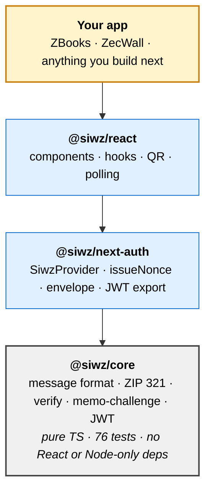

# SIWZ architecture

See [`architecture.svg`](./architecture.svg) for the visual.

## Three sign-in flows, one verifier dispatcher

The user picks how they sign in based on their wallet's capabilities. The server doesn't care which: every flow ends with a single `signIn(provider, credentials)` call into NextAuth.

| Flow | Wallet support | Proof artifact | Verifier sees | Latency |
|---|---|---|---|---|
| **A. Signmessage paste** | `zcash-cli`, YWallet | secp256k1 sig over magic-prefixed challenge | the signature | instant |
| **B. Memo-challenge** (default) | every shielded wallet | on-chain tx with `SIWZ:<nonce>` memo or unique amount | the tx via explorer | ~30s |
| **C. MetaMask Snap** | MetaMask + ChainSafe Snap | permission grant + UFVK | the HMAC-signed envelope | instant |

The `MemoSignIn` and `SignInWithZcash` components live side by side in the UI. Apps decide which to surface; some present all three. The example apps (ZBooks, comments wall) show different choices.

## Layered packages



Each layer is independently usable:

- An app that doesn't use NextAuth can call `@siwz/core` directly for verification.
- An app that wants a different UI can use `useSiwz()` headless from `@siwz/react` and skip the prebuilt component.
- A backend that doesn't use Next.js at all can use `@siwz/next-auth/nonce` for the stateless nonce helpers and ignore the rest.

## Explorer abstraction

The verifier needs to confirm a tx landed on-chain. The shape of that question depends on the service address type:

- **Transparent service address** asks "did anyone pay address X with amount Y?", which is answerable by any public block explorer. SIWZ ships free defaults; zero infra required.
- **Shielded service address** asks "did anyone include memo `SIWZ:<nonce>` in a note to address X?", which only the IVK holder can answer. Needs a Zcash daemon (HTTP RPC) or a light-wallet wrapper (`zingo-cli`) reachable from the server.

The shared interface in `@siwz/core/explorers`:

```ts
interface MemoExplorer {
  getRecentOutputsToAddress?(addr, limit): Promise<RecentOutput[]>;
  getRecentMemosToAddress?(addr, limit): Promise<RecentMemo[]>;
}
```

ZBooks extends this with additional methods (`getTransactionsForUfvk`, `getBalanceForUfvk`) that power its accounting and payouts; the SIWZ-protocol-level core stays minimal.

Implementations that ship today:

| Explorer | Package | Transparent | Shielded memos | Notes |
|---|---|---|---|---|
| `ThreeXplExplorer` | `@siwz/core/explorers` | ✅ | – | Defaults to 3xpl sandbox (anonymous, rate-limited). Pass `apiKey` for prod tier. |
| `BlockchairExplorer` | `@siwz/core/explorers` | ✅ | – | Public Zcash API. Free with rate limit; `apiKey` raises it. |
| `MultiExplorer` | `@siwz/core/explorers` | inherits | inherits | Wraps a list of explorers; falls back to the next on any thrown error. |
| `ZcashRpcExplorer` | apps/demo (reference) | ✅ | ✅ | Talks to your zcashd/zaino/zallet via HTTP or `zcash-cli`. |
| `LightwalletExplorer` | apps/demo (reference) | – | ✅ | HTTP client for the `apps/lightwallet-rpc` `zingo-cli` wrapper. Also satisfies UFVK sync/balance methods. |
| `MockExplorer` | apps/demo (reference) | ✅ | ✅ | In-memory, for DEMO mode and tests. |

`pollMemoHandler` from `@siwz/next-auth/memo` defaults to `new MultiExplorer([new ThreeXplExplorer(), new BlockchairExplorer()])` for transparent. Consumers don't have to think about explorers unless they want to override. See [`./shielded-deployment.md`](./shielded-deployment.md) for the lightwallet-rpc deployment recipe.

## ZBooks payouts: non-custodial, on top of the viewing key

ZBooks reuses the same view-only UFVK that powers its accounting to *pay*
contributors, without ever holding a spending key. It builds a single
multi-recipient ZIP 321 URI for a payout run; the treasurer signs in their own
wallet; ZBooks then watches the treasury UFVK and reconciles the outgoing tx back
to each payout line. Custodial sending was considered and rejected; PCZT
one-click signing is roadmap. Full design in [`../zbooks/payouts.md`](../zbooks/payouts.md).

## ZBooks data layer: encryption-at-rest and recovery

The ZBooks reference app stores its UFVKs and ledger in Turso (libSQL over
HTTPS). The non-protocol hardening layered on top:

- **UFVKs are encrypted at rest** with AES-256-GCM, key derived from
  `NEXTAUTH_SECRET` via HKDF-SHA256. A leaked Turso auth token alone does not
  leak any viewing keys; the encryption key has to be compromised separately.
- **Key mutation is owner-gated.** Treasurers can only rename or delete keys
  they added; admins keep full authority.
- **`/api/auth/memo/issue` and `/poll` are rate-limited per IP** in process
  (20/min and 90/min respectively). Not a fortress on multi-instance Vercel,
  but raises the cost of a single noisy attacker meaningfully.
- **Sync recovery.** Any UFVK row left stuck on `sync_status = 'syncing'` by a
  crashed process is reset to `idle` on the next DB initialisation, and the
  in-memory sync lock expires after 10 minutes so a process never blocks its
  own retries indefinitely.

Full descriptions, ciphertext format, and rotation guidance in
[`security.md`](../security.md#zbooks-application-layer-hardening).

## Stateless nonces

Both flows need replay protection. The classic approach is to store `(nonce, expiresAt)` server-side and check against the store on verify. That works but breaks under serverless (no shared state) and adds a dependency (Redis / DB).

SIWZ uses HMAC-signed nonce tokens instead. The server issues `nonce.expiresAt.HMAC(SECRET, nonce.expiresAt)`; the client round-trips the whole token back; the verifier checks the HMAC and the expiry. No storage required. Multiple serverless instances behind a load balancer work without coordination.

Same pattern is used for the memo-challenge token and the snap-auth envelope.

## Threat model: what's protected vs. what isn't

See [`security.md`](../security.md) for the full table. The short version:

- Protected: Replay across sessions, across apps, across networks, across the Zcash/Bitcoin universe.
- Protected: Address spoofing (cryptographically bound to the recovered pubkey or the matched on-chain tx).
- Protected: Tampering with the message after signing.
- Protected: Timing oracles in nonce verification.
- Not protected: XSS, CSRF on the credentials endpoint; your NextAuth deployment owns these.
- Not protected: Wallet UX phishing; you don't control what the user's wallet shows them before they sign.
- Not protected: Sybil for *transparent* sign-in (free); memo-challenge has natural Sybil resistance via the dust cost.

## Deployment shapes

The architecture supports several:

1. **Vercel + free public explorers**: transparent sign-in only. $0 infra. Default `MultiExplorer(3xpl + Blockchair)` covers it. ZBooks's current production-ready shape.
2. **Vercel + remote light-wallet RPC**: shielded sign-in. Add a $3-5/mo VPS running the apps/lightwallet-rpc Docker image (Zingo-CLI-based). See `./shielded-deployment.md`.
3. **Everything on one VPS**: simplest single-server deployment. Both flows available. Production trade-off: you maintain a server, you can't horizontally scale the wallet sync state.
4. **Self-hosted node + shielded**: for maximum privacy you can run your own zcashd or zallet and skip the light-wallet step. ~60 GB disk, multi-day sync, full sovereignty.

The protocol code is identical across all four. Only the explorer wiring and the env config differ.
