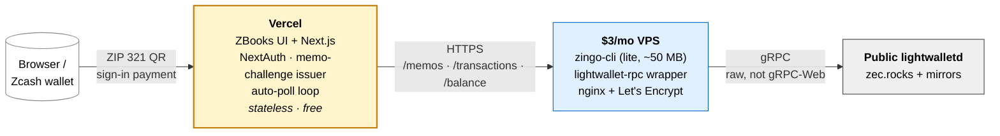

# Shielded SIWZ deployment on a $3/mo VPS

> The deployment shape that makes SIWZ end-to-end shielded: shielded service address, real on-chain memo decryption, no 60GB blockchain sync. Total monthly cost: **~$3** (RackNerd 2GB) or **~$5** (Hetzner CX22).

## The architecture in one picture



The VPS runs `zingo-cli` in lite mode (syncs only your service address from a public `lightwalletd`, ~50 MB disk) plus a small Node wrapper that exposes three POST endpoints over HTTPS:

- `POST /memos`: decrypt incoming memos for the service address (powers memo-challenge **sign-in**).
- `POST /transactions`: sync a UFVK's transaction history (powers ZBooks **accounting** and payout **reconciliation**).
- `POST /balance`: a UFVK's total and spendable balance (powers the payout **pre-flight** check and the treasury panel).

All three are view-only. The wrapper reads with viewing keys and never spends. ZBooks (deployed to Vercel for free) calls them when polling for new memos, syncing the books, or pricing a payout run.

**Net result:** users send a shielded payment with a memo from any wallet, the memo gets decrypted server-side using your IVK, and they're signed in. End-to-end shielded sign-in on Zcash mainnet, no full node, no 60GB.

## Why this avoids the 60–300 GB requirement

A standard "full" shielded verifier stack is **Zebra (or zcashd) full node + lightwalletd + your app**. The Zebra full node needs the entire blockchain locally, about 250 to 300 GB today and growing. lightwalletd is *just an indexer* in front of Zebra; it can't function alone.

We sidestep that by **not running our own full node at all**. Instead we point `zingo-cli` at a **public lightwalletd**, the same backend used by wallets like Zodl and YWallet. The wrapper passes `--server` explicitly and defaults to `https://zec.rocks:443`, the community-run endpoint that is actively maintained. Public lightwalletd use is common and accepted per ZecHub developer guidance.

The trade-off: the public lightwalletd operator can see which addresses you sync, but cannot decrypt your memos (they do not hold your IVK). Memos and balances stay private. For production at scale or maximum privacy, self-host the full stack on a bigger box; the wrapper code does not change.

### Lightwalletd endpoint failover

`LIGHTWALLETD` accepts a comma-separated list. The wrapper tries each endpoint in turn and retries the next one on a transient sync error, so a single slow or down server does not break a sync. The default list, and how to override it on the systemd unit:

```ini
[Service]
Environment=LIGHTWALLETD=https://zec.rocks:443,https://na.zec.rocks:443,https://eu.zec.rocks:443
```

| Endpoint | Operator | Notes |
|---|---|---|
| `https://zec.rocks:443` | Community | Default, actively maintained, fastest in testing |
| `https://na.zec.rocks:443` | Community | North America mirror |
| `https://eu.zec.rocks:443` | Community | EU mirror |
| `https://mainnet.lightwalletd.com:9067` | Electric Coin Company | Deprecated. Unreachable as of mid-2026; do not use |

## What you need before starting

- A VPS (Ubuntu 22.04 or 24.04 recommended).
  - **RackNerd 2GB plan**, ~$36/year ([specials page](https://racknerd.com/specials)).
  - Alternative: Hetzner CX22, ~€4.51/month.
  - Anything ≥2 GB RAM, ≥20 GB SSD will work.
- A domain name (or subdomain) you can point at the VPS. Cost: $0 (subdomain on a domain you own) up to ~$10/year for a fresh one.
- Your forked SWZ repo URL.
- A Zcash mainnet address inside `zingo-cli` (the script will help you generate one).

## 15-minute install

After provisioning the VPS, SSH in and run:

```bash
# Optional but recommended on a tight VPS: 2GB swap as a safety net
sudo fallocate -l 2G /swapfile && sudo chmod 600 /swapfile && sudo mkswap /swapfile && sudo swapon /swapfile
echo '/swapfile none swap sw 0 0' | sudo tee -a /etc/fstab

# Then the one-shot installer:
curl -sL https://raw.githubusercontent.com/<your-org>/SWZ/main/scripts/setup-lightwallet-vps.sh \
  | RPC_DOMAIN=rpc.your-domain.com \
    LETSENCRYPT_EMAIL=you@you.com \
    SWZ_REPO=https://github.com/<your-org>/SWZ \
    bash
```

The script ([`scripts/setup-lightwallet-vps.sh`](../../scripts/setup-lightwallet-vps.sh)) does:

1. `apt update` + installs Node 20, nginx, certbot, ufw, git.
2. Configures firewall (SSH + nginx, nothing else).
3. Creates a dedicated `siwz` user.
4. Installs `zingo-cli` (precompiled if available, source build otherwise).
5. Drops you into the `zingo-cli` REPL so you can run `new` (creates wallet, prints seed; **save the seed**) and `addresses` (copy your zs… or u1… address).
6. Clones your SWZ repo.
7. Generates a 32-char RPC token.
8. Installs a systemd unit that runs `apps/lightwallet-rpc/src/server.mjs` with `MemoryMax=1200M` (zingo-cli + a synced wallet comfortably fit; smaller caps OOM-kill mid-sync).
9. Configures nginx to proxy `https://rpc.your-domain.com` → `127.0.0.1:18232` with rate-limiting **and** `proxy_read_timeout 600s` (so first syncs don't hit the default 60s timeout).
10. Runs `certbot --nginx` to issue a TLS cert.
11. Prints the env vars to paste into ZBooks.

End state: a `curl https://rpc.your-domain.com/health` returns `{ok: true}`.

## Configure ZBooks

In your Vercel project settings (or wherever you host ZBooks):

```env
SIWZ_SERVICE_ADDRESS=zs1...   # or u1..., the address you copied from zingo-cli
LIGHTWALLET_RPC_URL=https://rpc.your-domain.com
LIGHTWALLET_RPC_TOKEN=<the long random token the installer printed>
SIWZ_DEMO=0
```

Redeploy. The `getShieldedExplorer()` dispatcher in [`apps/demo/src/lib/explorer.ts`](../../apps/demo/src/lib/explorer.ts) auto-picks `LightwalletExplorer` when `LIGHTWALLET_RPC_URL` is set. The memo-challenge issue and poll endpoints now operate against your shielded address with real on-chain memo decryption.

## What the end-to-end demo looks like now

1. User opens ZBooks at `https://zbooks.your-domain.com`.
2. User clicks "Sign in with Zcash".
3. ZBooks issues a memo-challenge. UI renders a QR encoding `zcash:zs1...?amount=0.000001&memo=U0lXWjpAYmNkZWY...` (base64url of `SIWZ:abcdef…`).
4. User scans the QR with Zodl / YWallet / Zingo. Wallet opens with the tx pre-filled.
5. User confirms. The shielded tx broadcasts.
6. Usually within 5 to 15 seconds, `lightwalletd` includes the block. `zingo-cli` on the VPS decrypts the note with your IVK. The memo `SIWZ:abcdef…` becomes visible to `zingo-cli list`.
7. ZBooks's polling loop hits `https://rpc.your-domain.com/memos`. The wrapper shells out to `zingo-cli list`, finds the matching memo, returns it.
8. ZBooks's poll endpoint matches the nonce in the memo against the issued challenge token, mints a NextAuth session, signs the user in.

All shielded. No transparent fallback in this path. The Zcash protocol is being used in the privacy direction for the entire ceremony.

## Operating the lightwallet RPC

```bash
# Logs
sudo journalctl -u siwz-lightwallet -f

# Health
curl -s https://rpc.your-domain.com/health

# Restart after config changes
sudo systemctl restart siwz-lightwallet

# Force a fresh per-UFVK sync (clears all wallet dirs; next request re-bootstraps with --viewkey + --birthday)
sudo rm -rf /home/siwz/.zingo-ufvks && sudo systemctl restart siwz-lightwallet
```

## Bonus: ChainSafe's gRPC-Web proxy for browser-side SIWZ

If you build a future SIWZ-using app that runs **entirely in the browser** (no Node backend at all), you'll need a **gRPC-Web** endpoint, because browsers cannot speak raw gRPC to a normal lightwalletd. ChainSafe runs a public gRPC-Web proxy specifically for this:

```
https://zcash-mainnet.chainsafe.dev
```

This is what ChainSafe's WebZjs library and Zcash MetaMask Snap use. Our `zingo-cli`-based architecture doesn't use it (zingo speaks raw gRPC), but if you wire SIWZ directly into a browser app via WebZjs in the future, this is the endpoint to pass.

> **Honest note on WebZjs as a Node library**: as of this writing (May 2026), the `@chainsafe/webzjs-wallet` npm package referenced in WebZjs's repo README is **not yet published** to the npm registry. I verified against `https://registry.npmjs.com/@chainsafe/webzjs-wallet` (404). The only ChainSafe WebZjs-related package currently installable from npm is `@chainsafe/webzjs-zcash-snap` (the MetaMask Snap), which we integrate via [`packages/siwz-react/src/snap.ts`](../../packages/siwz-react/src/snap.ts). When ChainSafe publishes the lite-wallet library, a future `WebZjsExplorer` could replace this VPS in pure-serverless deployments. For now, `zingo-cli` on a small VPS is the only working server-side option for shielded sign-in.

If you ever want to migrate the wallet to another VPS:

```bash
# On the old VPS:
sudo -u siwz tar czf ~/zingo-backup.tgz -C /home/siwz .zingo
scp ~/zingo-backup.tgz new-vps:~/

# On the new one, after running the installer:
sudo systemctl stop siwz-lightwallet
sudo -u siwz tar xzf ~/zingo-backup.tgz -C /home/siwz
sudo systemctl start siwz-lightwallet
```

## Security notes

- **The bearer token is your only auth.** Treat it like an API key. Don't commit it. Rotate by editing the systemd unit + restarting.
- **TLS is mandatory.** Without it, the memos and token transit in plaintext over the public internet.
- **The VPS holds your wallet's spending key.** This is unavoidable: `zingo-cli` needs the full viewing+spending key to sync. If you want privilege separation, generate the address on a separate machine and import only the IVK into the VPS via `z_importviewingkey`. The wrapper will still work read-only with just the IVK.
- **The VPS does NOT need to be your existing one.** Strongly recommend a dedicated $3 VPS so the wrapper's resource usage can't affect your other workloads.
- **`zingo-cli` upgrades:** the wrapper parses zingo's JSON output. Major version changes might shift field names, so pin a specific zingo release tag in production and test upgrades on a staging VPS first.

## Why not a full lightwalletd of your own?

You can run your own `lightwalletd` instead of a public one. It adds privacy, since the public server learns which addresses you sync. But running `lightwalletd` requires a full `zcashd` behind it, which is the 60GB sync we are explicitly avoiding. For the hackathon, a public endpoint (zec.rocks) is fine. Migrate later when privacy budget warrants.

## Cost summary

| Item | Cost |
|---|---|
| VPS (RackNerd 2GB) | $36/year ≈ **$3/month** |
| Domain (optional, reuse one you own) | $0–$10/year |
| TLS cert (Let's Encrypt) | $0 |
| Vercel hosting for ZBooks | $0 (Hobby plan) |
| **Total** | **~$3/month** |

If the hackathon prize lands in even Top 10 of the 25 ZEC pool, the entire year of infra costs is covered ~50×.
