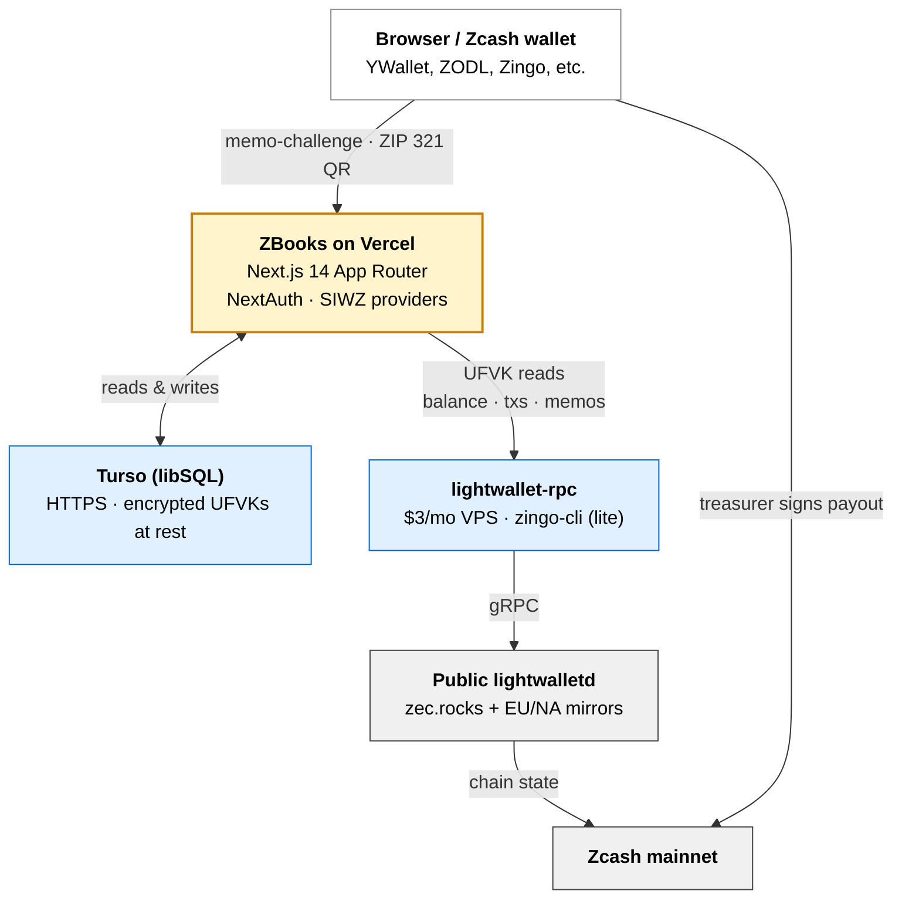
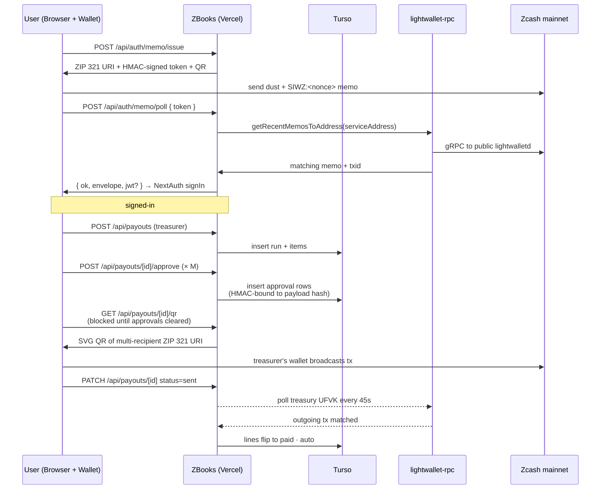
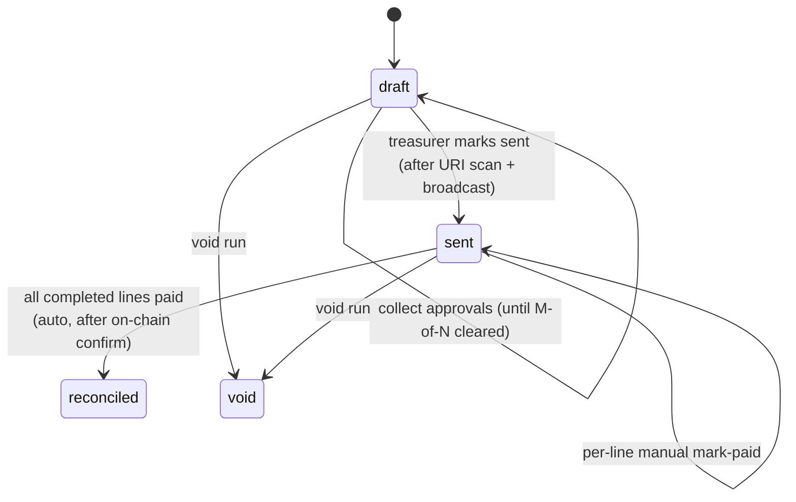

# ZBooks architecture

How the app is put together: the stack, the data model, the request flow, the integration points, and where the deeper docs live for the parts that need them.

## Overview

ZBooks is a Next.js 14 App Router application that reads shielded Zcash funds through Unified Full Viewing Keys (UFVKs) and orchestrates non-custodial batch payouts via multi-recipient ZIP 321. It never holds a spending key. The treasurer's own wallet signs every transaction; ZBooks just composes the URI, watches the chain for confirmation, and posts the result into the books.

The auth layer is [SIWZ](../siwz/), shipped alongside ZBooks as three reusable npm packages. Three sign-in flows are wired up: memo-challenge (universal), signmessage paste, and MetaMask + ChainSafe Zcash Snap.

## Stack

| Layer | Choice | Why |
|---|---|---|
| Frontend + server | Next.js 14 App Router on Vercel | Free for hobby use, edge-friendly, file-based routing matches the role-gated pages cleanly. |
| Auth | NextAuth.js v4 + [`@siwz/next-auth`](../../packages/siwz-next-auth) credentials providers | One session shape across three SIWZ flows. |
| Database | Turso (libSQL over HTTPS) | Works from any serverless region without a connection pool. SQLite semantics, JSON-aware. |
| Shielded reads | `apps/lightwallet-rpc` on a $3/mo VPS | `zingo-cli` lite mode (~50 MB) is the lightest way to hold an IVK for memo decryption. Detailed recipe in [`siwz/shielded-deployment.md`](../siwz/shielded-deployment.md). |
| Background sync | In-tab `BackgroundSync` (5-min interval) + optional cron job hitting `/api/cron/sync-keys` | Keeps the treasury UFVK current without a long-running worker. |
| Encryption at rest | AES-256-GCM, key derived from `NEXTAUTH_SECRET` via HKDF-SHA256 | A leaked Turso token alone does not reveal viewing keys. Details in [`security.md`](../security.md). |

## Data model

The database schema is in [`apps/demo/src/lib/db.ts`](../../apps/demo/src/lib/db.ts). Idempotent migrations run on first request after deploy.

| Table | Purpose |
|---|---|
| `team` | Members and their roles (admin / treasurer / viewer). First sign-in becomes admin unless `SIWZ_ADMIN_ADDRESSES` is set. |
| `ufvks` | Unified Full Viewing Keys watched by the workspace. Ciphertext stored in `ufvk` (AES-256-GCM); plaintext SHA-256 in `ufvk_hash` (unique) prevents duplicate adds. Sync state, birthday, primary flag. |
| `transactions` | One row per synced tx per UFVK. Direction, amount, memo, counterparty, block height, optional tag and notes, audit fields (`tagged_by`, `tagged_at`). |
| `counterparties` | Address-to-label map. A label renders everywhere a counterparty appears. |
| `payees` | Named contributors a workspace pays. Separate from `counterparties`: counterparties label what ZBooks observes, payees are who you actively pay. |
| `payout_runs` | One row per payout cycle. Holds title, source UFVK, status (draft/sent/reconciled/void), `required_approvals` snapshotted from workspace settings at creation. |
| `payout_items` | Line items inside a run. Payee, amount, memo, work status (`in_progress`/`completed`), pay status, optional `external_ref` for ZecBounties dedup, optional txid + paid block once reconciled. |
| `payout_run_approvals` | M-of-N approvals. Bound by HMAC to `(run_id, approver_address, payload_hash)`. Editing any payable line changes the payload hash, which invalidates older approvals automatically. |
| `workspace_settings` | Singleton row (`id = 1`). Holds `min_approvals` and the JSON list of `approver_addresses`. New runs snapshot the threshold; later edits don't shift older runs. |
| `fiat_prices` | ZEC/USD by UTC date (`YYYY-MM-DD`). Backfilled lazily when a report renders. |

## Request flow

The end-to-end memo-challenge sign-in plus a typical payout:

## Integration points

ZBooks integrates with exactly three external things:

| Integration | Purpose | Where |
|---|---|---|
| **SIWZ** | Authentication. Three flows (memo, signed message, snap) under one NextAuth surface. | `apps/demo/src/lib/auth.ts` |
| **lightwallet-rpc** | Shielded UFVK reads: transactions, balance, memo decryption. Optional but needed for any shielded sign-in or for ZBooks accounting against shielded keys. | `apps/demo/src/lib/explorer.ts` (the `LightwalletExplorer` class) |
| **ZecBounties API** | Importing completed bounties from `bounties.zechub.wiki` as draft payout lines. External-ref dedup, network detection (testnet bounties blocked on mainnet deploys). | `apps/demo/src/lib/zec-bounties.ts` |

No other external services. The Discord webhook is optional and sends, never reads.

## Payout pipeline (at a glance)

A run moves through this lifecycle. Full design in [`payouts.md`](./payouts.md).

Each transition emits an audit row. Pay-status flips on `payout_items` are recorded with txid and paid_block when auto-reconciliation fires.

## Approval gate (at a glance)

When `workspace_settings.min_approvals > 1`, the payout endpoint that returns the ZIP 321 URI refuses until enough approvals have been recorded against the run's current `payload_hash`. Editing any line item changes the hash, which makes older approvals stale (kept for audit, but not counted). Full mechanics in [`payouts.md`](./payouts.md).

```mermaid
flowchart LR
    A[Draft run<br/>required_approvals = 2] --> B
    B[Approve A<br/>HMAC bound to payload v1] --> C
    C[Edit line item amount] --> D
    D[payload v2 ≠ v1<br/>A's approval now stale]
    D --> E[Approve A again<br/>HMAC bound to payload v2]
    E --> F[Approve B<br/>HMAC bound to payload v2]
    F --> G[2 of 2 cleared<br/>URI now reveals]
    classDef draft fill:#fff4cc,stroke:#c77f0e,color:#000;
    classDef stale fill:#ffe5e5,stroke:#b00,color:#000;
    classDef cleared fill:#d4f7d4,stroke:#0a7a0a,color:#000;
    class A,B draft;
    class C,D stale;
    class E,F,G cleared;
```

## Encryption and key management

Two layers protect viewing keys:

1. **Transport.** Turso connections are HTTPS-only. Vercel functions reach Turso via auth-token-gated APIs.
2. **At rest.** Each UFVK is encrypted before insert (AES-256-GCM, per-row IV, key derived from `NEXTAUTH_SECRET` via HKDF-SHA256). A leaked Turso auth token alone does not reveal a viewing key; the encryption secret has to be compromised separately.

Companion safeguards: owner-gated key mutation (treasurers can only rename or delete keys they added), in-process rate limiting on memo endpoints (20 issue/min, 90 poll/min per IP), and stale-sync recovery so a UFVK row stuck on `sync_status = 'syncing'` after a crashed process resets to `idle` on next DB initialisation.

Full rotation, ciphertext format, and threat-model details in [`security.md`](../security.md).

## Deployment shape

| Component | Host | Cost |
|---|---|---|
| ZBooks UI + API | Vercel (Hobby tier) | $0 |
| Database | Turso (free tier covers hackathon volume) | $0 |
| Shielded reads | $3/mo VPS running `apps/lightwallet-rpc` | $3 |
| Public lightwalletd | `zec.rocks` + EU/NA mirrors (community-run) | $0 |
| Optional Discord webhook | Any Discord server | $0 |

Total: roughly $3 per month for a mainnet deployment. The shielded VPS step can be skipped entirely if the workspace only watches transparent UFVKs; in that case ZBooks runs free.

Full deployment walkthrough in [`siwz/shielded-deployment.md`](../siwz/shielded-deployment.md).

## What lives where

Quick map for someone reading the code cold:

| Concern | File |
|---|---|
| Auth (NextAuth + SIWZ providers) | [`apps/demo/src/lib/auth.ts`](../../apps/demo/src/lib/auth.ts) |
| DB layer, all queries, migrations | [`apps/demo/src/lib/db.ts`](../../apps/demo/src/lib/db.ts) |
| UFVK encryption at rest | [`apps/demo/src/lib/crypto-at-rest.ts`](../../apps/demo/src/lib/crypto-at-rest.ts) |
| Payout pipeline (preflight, URI build, approval state) | [`apps/demo/src/lib/payouts.ts`](../../apps/demo/src/lib/payouts.ts) |
| Auto-reconciliation algorithm | `reconcileRun()` in [`db.ts`](../../apps/demo/src/lib/db.ts) |
| ZecBounties import | [`apps/demo/src/lib/zec-bounties.ts`](../../apps/demo/src/lib/zec-bounties.ts) |
| Shielded UFVK reads | [`apps/demo/src/lib/explorer.ts`](../../apps/demo/src/lib/explorer.ts) (the `LightwalletExplorer` class) |
| Role and session helpers | [`apps/demo/src/lib/session.ts`](../../apps/demo/src/lib/session.ts) |
| Discord webhook | [`apps/demo/src/lib/discord.ts`](../../apps/demo/src/lib/discord.ts) |
| Background sync ticker | [`apps/demo/src/components/BackgroundSync.tsx`](../../apps/demo/src/components/BackgroundSync.tsx) |

## Related docs

- [`guide.md`](./guide.md): page-by-page user guide, role matrix, auditing a wallet for undocumented transactions.
- [`payouts.md`](./payouts.md): the payout system in depth, M-of-N approval HMAC details, auto-reconciliation algorithm.
- [`../security.md`](../security.md): cross-cutting threat model. Includes the ZBooks application-layer hardening section.
- [`../system-workflow.md`](../system-workflow.md): the integrated SIWZ + ZBooks story, for someone reading the system end to end for the first time.
- [`../siwz/`](../siwz/): the auth foundation. Protocol spec, integration guide, wallet matrix, deployment recipe.
