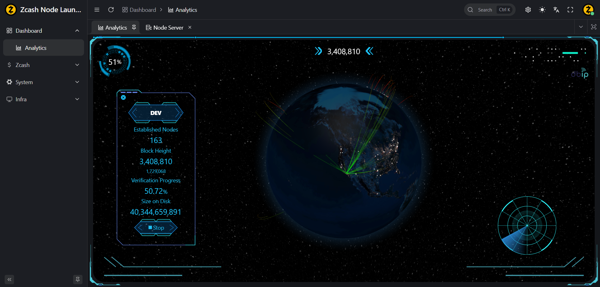
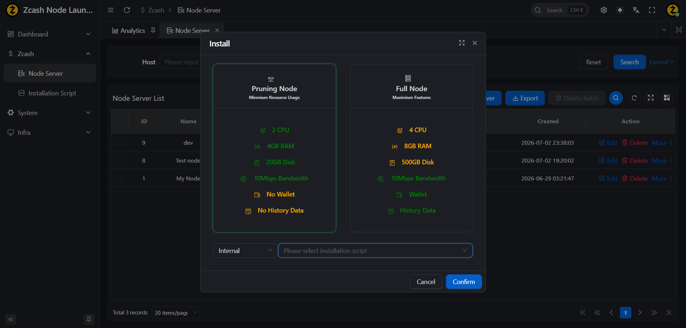
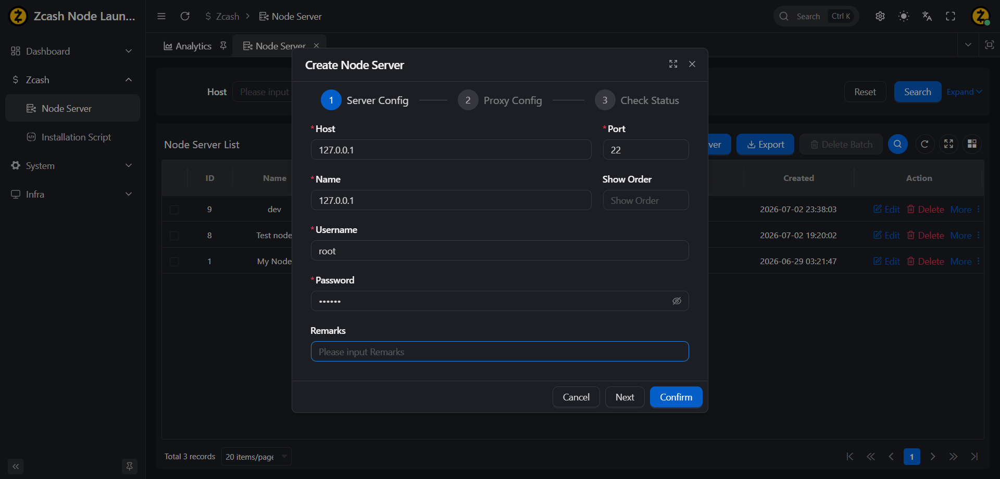
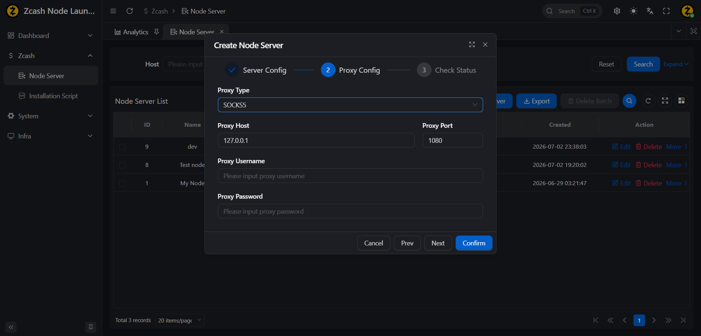
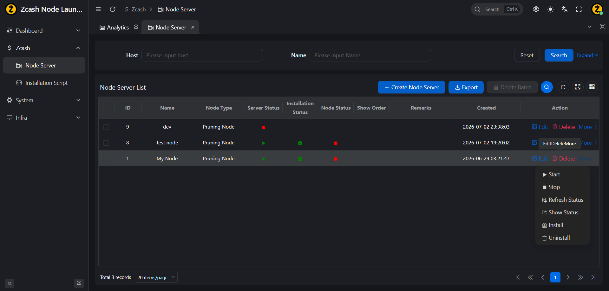

# ZcashNodeLauncher

[](LICENSE)

The **Zcash Node Launcher** is a comprehensive management tool designed for deploying, operating, and monitoring Zcash nodes. It provides automated installation/uninstallation, node lifecycle management, and a real-time geospatial monitoring dashboard.

## Table of Contents

- [Features](#features)
- [Development Environment](#development-environment)
- [Build and Run](#build-and-run)
- [Run the Release Package](#run-the-release-package)
- [License](#license)
- [Acknowledgements](#acknowledgements)

## Features

- [Demo](https://demo-zcashnodelauncher.zcashjava.com)
- [Video](https://youtu.be/1tkV1Qd-UdU)


- **Node Server Management**: Create, install, uninstall, start, stop, and check the status of node instances.
- **Script Management**: Support custom installation scripts when the built‑in installer does not meet specific requirements.
- **Dashboard**: Real-time geospatial dashboard displaying node status, block height, verification progress, and active node connections.
- **Platform Support**: Compatible with AlmaLinux 9/10, CentOS 9/10, Debian 11, Fedora 43, Ubuntu 22.04, with additional platforms coming soon.
- **Base Framework**: Includes user, role, menu, and permission management, along with a complete authentication module.











## Development Environment

- **znl-api**: JDK 8, Spring Tools Suite, Maven, MySQL 8, Redis  
- **znl-ui**: Node.js 20.18.2, VSCode

## Build and Run

- Install MySQL 8, JDK 8, Maven, Redis, and Node.js 20.
- Download the dbip database file from https://github.com/sapics/ip-location-db or the official website.
- Create a database named `znl`. Use MySQL Workbench or the MySQL CLI `source` command to import `znl-api/sql/mysql/znl.20260704024909-clear-db.sql`.
- Locate the configuration file at `znl-api/znl-api-server/src/main/resources/application-prod.yaml` and update the MySQL and Redis settings according to your environment.
- Enter the `znl-ui` project, run `npm run build:antd`, then copy `znl-ui/apps/web-antd/dist/*` into `znl-api/znl-api-server/src/main/resources/static`.
- Enter the `znl-api` project and run `mvn clean install -Dmaven.test.skip=true`.
- Create a directory to store the application and its logs, then copy `znl-api/znl-api-server/target/znl-api-server.jar` into that directory.
- Start the application using:  
  `java -jar znl-api-server.jar --spring.profiles.active=prod --logging.config=classpath:logback-production.xml --server.port=48080 --znl.dbip.bin-file-path=dbip/dbip-city-lite-2026-07.mmdb`
- Open your browser and navigate to http://127.0.0.1:48080/.  
  The default username and password are both `zcashjava`.

## Run the Release Package

- Download the latest release from [Releases](https://github.com/zcashjava/ZcashNodeLauncher/releases) and extract the zip file:
``` bash
    ZcashNodeLauncher-1.0.0/
    ├── dbip
    ├── application-prod.yaml
    ├── start.bat
    ├── start.sh
    ├── znl.20260704024909-clear-db.sql
    └── znl-api-server.jar
```

- Install Redis and MySQL, then start both services.
- Import `znl.20260704024909-clear-db.sql` into MySQL.
- Open `application-prod.yaml` and update the database URL, username, password, and Redis configuration.
- Enter the `ZcashNodeLauncher-1.0.0` directory and run `start.bat` or `start.sh`.
- Open your browser and navigate to [http://127.0.0.1:48080/](http://127.0.0.1:48080/).  
  The default username and password are both `zcashjava`.

## License

This project is licensed under the MIT License. See the [LICENSE](LICENSE) file for details.

## Acknowledgements

- **[Zcash](https://github.com/zcash/zcash)**
- **[Spring](https://spring.io)**
- **[Spring Tool Suite](https://spring.io/tools#eclipse)**
- **[MySQL](https://www.mysql.com/products/community/)**
- **[Redis](https://redis.io/)**
- **[Vben Admin](https://github.com/vbenjs/vue-vben-admin)**
- **[ruoyi-vue-pro](https://github.com/YunaiV/ruoyi-vue-pro)**
- **[DataV](https://github.com/DataV-Team/DataV-Vue3)**
- **[Globe.gl](https://github.com/vasturiano/globe.gl)**
- **[db-ip](https://db-ip.com/db/download/ip-to-city-lite)**
